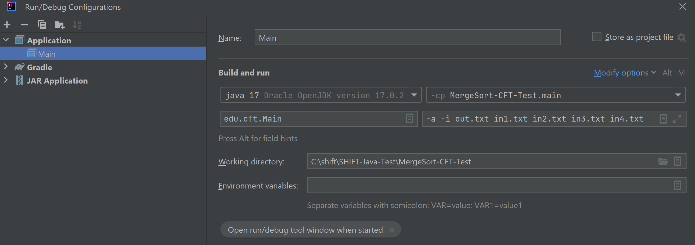

# SHIFT-Java-Test

### JDK Version:

* 17

### Система сборки:

* Gradle 7.5.1

### Библиотеки:

* org.junit.jupiter:junit-jupiter-api:5.8.1
* org.junit.jupiter:junit-jupiter-engine:5.8.1

dependencies {
    testImplementation 'org.junit.jupiter:junit-jupiter-api:5.8.1'
    testRuntimeOnly 'org.junit.jupiter:junit-jupiter-engine:5.8.1'
}

### Запуск (1 способ, Intellij IDEA):

* Настроить конфигурацию, указав параметры запуска:



Рисунок 1 - Настройки конфигурации

* Запустить программу

### Программа содержит:

* unit-тесты, запустить можно с помощью команды ```gradle test```
* при запуске программы в консоль выводится информация о установленных параметрах (порядок сортировки, тип данных, выходной файл, входные файлы)

### Особенности реализации:

* дефолтные настройки: 1. порядок сортировки - возрастающий, 2. если указанного выходного файла не существует, он будет создан программой
*  если указан хотя бы один входной файл, то программа выполнится
*  выведется сообщения об ошибки, если:
     1. введено меньше 3 аргументов
     2. не будет флага -i или -s
     3. не будет найдено хотя бы 1 входного файла
* если будет нарушен порядок сортировки, то программа продолжит выполняться и сообщит о нарушениях в конце работы программы с указанием названия файла
* при обнаружении несоответсвия указанного типа сортировки с сортировкой в файле, программа перестает считывать значения из файла
* строки с пробельными символами не обрабатываются

### Алгоритм для работы с большими файлами:

Создаётся n reader-ов, где n - количество входных файлов, из каждого reader-а считывается одно значение и помещается в массив, из которого выбирается подходящее по условиям сортировки и записывается в выходной файл. Далее действия повторяются уже с новыми значениями из файлов, пока соблюдается порядок сортировки и есть данные для чтения.
